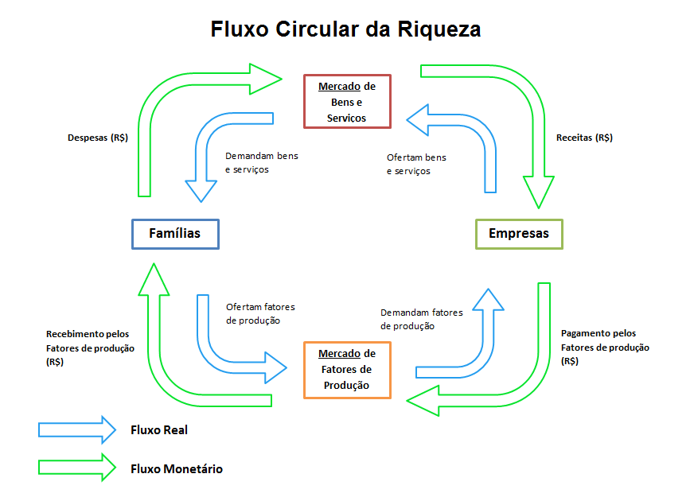
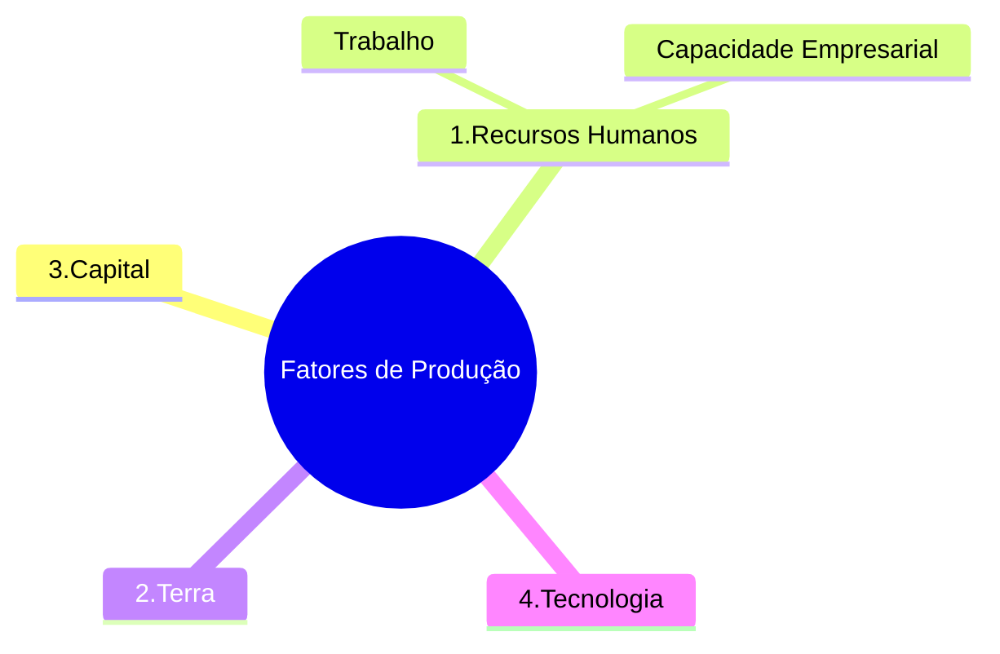

<table align="right" border="0">
  <tr>
    <td align="center" valign="top">
      <a href="https://github.com/dnlclaudino/gestao-do-conhecimento#readme">
         Início da  Gestão do  Conhecimento</a>
      </td>
      <td>
        <a href="https://github.com/dnlclaudino/economia/tree/master/livro-VASCONCELOS-GARCIA-2012-fundamentos-de-economia#readme">
         Sumário da Fonte
      </a>
    </td>
    <td align="center" valign="top">
      <a href="https://github.com/dnlclaudino/economia#readme">
         Início deste  Repositório
      </a>
    </td>
    <td align="center" valign="top">
         Baixar em PDF
    </td>
  </tr>
</table>        

# Capítulo 01 - Introdução à Economia 📖

<b>SUMÁRIO</b>

- [Capítulo 01 - Introdução à Economia 📖](#capítulo-01---introdução-à-economia-)
  - [1.1 Introdução](#11-introdução)
  - [1.2 Conceito de Economia](#12-conceito-de-economia)
  - [1.3 Sistemas econômicos e os problemas econômicos fundamentais](#13-sistemas-econômicos-e-os-problemas-econômicos-fundamentais)
    - [Definição de Sistema Econômico](#definição-de-sistema-econômico)
    - [Elementos Básicos de um Sistema Econômico](#elementos-básicos-de-um-sistema-econômico)
    - [Classificação dos Sistemas Econômicos](#classificação-dos-sistemas-econômicos)
      - [Sistema Econômico CAPITALISTA](#sistema-econômico-capitalista)
      - [Sistema Econômico SOCIALISTA (Economia Centralizada ou Economia Planificada)](#sistema-econômico-socialista-economia-centralizada-ou-economia-planificada)
      - [Sistema Econômico MISTO](#sistema-econômico-misto)
    - [Os Problemas Econômicos Fundamentais](#os-problemas-econômicos-fundamentais)
      - [O QUE PRODUZIR ?](#o-que-produzir-)
      - [QUANTO PRODUZIR ?](#quanto-produzir-)
      - [COMO PRODUZIR ?](#como-produzir-)
      - [PARA QUEM PRODUZIR ?](#para-quem-produzir-)
  - [1.4 Curva de Possibilidades de Produção (CPP ou Curva de Transformação)](#14-curva-de-possibilidades-de-produção-cpp-ou-curva-de-transformação)
    - [1.4.1 Custo de oportunidade](#141-custo-de-oportunidade)
    - [1.4.2 Deslocamentos da curva de possibilidades de produção](#142-deslocamentos-da-curva-de-possibilidades-de-produção)
  - [1.5 Funcionamento de uma economia de mercado: fluxos reais e monetários](#15-funcionamento-de-uma-economia-de-mercado-fluxos-reais-e-monetários)
    - [FLUXO CIRCULAR DE RENDA ou FLUXO CIRCULAR DA RIQUEZA](#fluxo-circular-de-renda-ou-fluxo-circular-da-riqueza)
    - [Para entender o FUNCIONAMENTO DO SISTEMA ECONÔMICO](#para-entender-o-funcionamento-do-sistema-econômico)
    - [1.5.1 Classificação dos Bens](#151-classificação-dos-bens)
      - [Bens de Capital](#bens-de-capital)
      - [Bens de Consumo](#bens-de-consumo)
      - [Bens de Intermediários](#bens-de-intermediários)
      - [Bens de Finais](#bens-de-finais)
      - [Fatores de Produção](#fatores-de-produção)
    - [1.5.2 Relação entre FATOR DE PRODUÇÃO e TIPO DE REMUNERAÇÃO](#152-relação-entre-fator-de-produção-e-tipo-de-remuneração)
  - [1.6 Argumentos positivos versus argumentos normativos](#16-argumentos-positivos-versus-argumentos-normativos)
  - [1.7 Inter-relação da Economia com outras áreas do conhecimento](#17-inter-relação-da-economia-com-outras-áreas-do-conhecimento)
    - [1.7.1 Economia, Física e Biologia](#171-economia-física-e-biologia)
    - [1.7.2 Economia, Matemática e Estatística](#172-economia-matemática-e-estatística)
    - [1.7.3 Economia e Política](#173-economia-e-política)
    - [1.7.4 Economia e História](#174-economia-e-história)
    - [1.7.5 Economia e Geografia](#175-economia-e-geografia)
    - [1.7.6 Economia, Moral, Justiça e Filosofia](#176-economia-moral-justiça-e-filosofia)
  - [1.8 Divisão do estudo econômico](#18-divisão-do-estudo-econômico)

## 1.1 Introdução

- Nosso cotidiano está repleto de situações em que nos deparamos com as chamadas **questões econômicas**:
  - Aumento de preços;
  - Desemprego;
  - Deficit governamental;
  - Impostos;
  - Inflação;
  - Ociosidade de alguns setores de atividade
  - Dentre inúmeros outros;
- É alguns casos, em que precisamos tomar decisões importantes e, principalmente sermos responsabilizados por elas, precisamos de **conhecimentos teóricos** para podermos melhor analisar **as questões econômicas** e **os problemas econômicos**;
  - Seja como um empreendedor, seja como um operador do Direito;

<!-- Para visualizar os ícones disponíveis, visite: https://github.com/dnlclaudino/imagens#readme -->
<table border="1" id="quadro-definicao-XXXXX">
<tr>
  <td align="center" valign="top"width="140px" style="border-right-style:hidden">
    
   <b>Objetivo do Estudo da Ciência Econômica (Economia)</b>
  </td>
  <td valign="top">

<b>O <u>OBJETIVO</u> DO ESTUDO DA CIÊNCIA ECONÔMICA</b> Por que estudar a Ciência Econômica ?

  

    Estuda-se Ciência Econômica (Economia) para:
  

     <ul>
       <li>Identificar, analisar e descrever adequadamente os <b>problemas econômicos</b>;</li>
       <li>Formularmos adequadamente <b>soluções</b> para <b>resolvê-los</b>;</li>
     </ul>
   
Isso posto, conclui-se que, um vez alcançado esses objetivos intermediários, alcançaremos o <b><u>objetivo maior do estudo da ciência econômica</u></b> que é <b>a melhora de nossa <u>qualidade de vida</u></b>
  
   </td>
</tr>
</table>

## 1.2 Conceito de Economia

- A palavra **ECONOMIA**:
  - Deriva do grego _oikonomos_
    - _oiko_ = casa
    - _nomos_ = lei
  - Significa: "A administração de uma casa ou do Estado";

<table border="1" id="quadro-conceito-economia">
<tr>
  <td align="center" valign="top"width="140px" style="border-right-style:hidden">
    
   <b>Conceito</b>
  </td>
  <td valign="top">

<b>O CONCEITO DE <u>ECONOMIA</u></b>

  

    <b>ECONOMIA</b> é a <b>CIÊNCIA SOCIAL</b>:
  

     <ul>
       <li>QUE <b>ESTUDA COMO</b></li>
       <ul>
         <li>O indivíduo; e/ou</li>
         <li>A sociedade</li>
       </ul>
       <li><b>DECIDEM</b></li>
        <ul>
          <li>Empregar <b>RECURSOS PRODUTIVOS ESCASSOS</b></li>
          <ul>
            <li>Na produção de bens;</li>
            <li>Na produção de serviços;</li>
          </ul>
        </ul>
       <li><b>De MODO A</b></li>
       <ul>
        <li>Distribuí-los entre as várias PESSOAS e GRUPOS da sociedade</li>
       </ul>
       <li>Com a <b>FINALIDADE</b> de <b>SATISFAZER</b> as <b>NECESSIDADES HUMANAS</b>.</li>
     </ul>
   </td>
</tr>
</table>

- São elementos **essenciais** ao **conceito de economia** os seguintes elementes que são tratados como sua **base** e **objetos de estudo**:
  - A escolha;
  - A escassez;
  - As necessidades humanas;
  - Recursos;
  - Produção
  - Distribuição

<table border="1" id="quadro-lembre-se-recursos-escassez">
<tr>
  <td align="center" valign="top"width="140px" style="border-right-style:hidden">
    
   <b>Lembre-se</b>
  </td>
  <td valign="top">
   
<b>OS RECURSOS E A ESCASSEZ</b>

   

    Em qualquer sociedade, os <b>RECURSOS(fatores de produção)</b>  <b>são escassos</b>.
   

  </td>
</tr>
</table>

<table border="1" id="quadro-lembre-se-necessidades-humanas-ilimitadas">
<tr>
  <td align="center" valign="top"width="140px" style="border-right-style:hidden">
    
   <b>Lembre-se</b>
  </td>
  <td valign="top">
   
<b>AS NECESSIDADES HUMANAS E A ESCASSEZ</b>

   

    Em qualquer sociedade, as <b>NECESSIDADES HUMANAS</b>:
    <ul>
      <li>São <b>ILIMITADAS</b>; e</li>
      <li><b><u>Sempre</u> SE RENOVAM</b></li>
    </ul>
   

  </td>
</tr>
</table>

## 1.3 Sistemas econômicos e os problemas econômicos fundamentais

### Definição de Sistema Econômico

<table border="1" id="quadro-definicao-sistema-economico">
<tr>
  <td align="center" valign="top"width="140px" style="border-right-style:hidden">
    
   <b>Definição</b>
  </td>
  <td valign="top">

<b>O QUE É UM <u>SISTEMA ECONÔMICO</u> ?</b>

  

    Um <u>SISTEMA ECONÔMICO</u> é a forma:
  

   <ul>
     <li>Política;</li>
     <li>Social; e</li>
     <li>Econômica</li>
   </ul>
   

    pela qual está <b>ORGANIZADA</b> a <b>UMA SOCIEDADE</b>;
  

   </td>
</tr>
</table>

### Elementos Básicos de um Sistema Econômico

- Os **ELEMENTOS BÁSICOS** de um **SISTEMA ECONÔMICO** são:
  - **Estoque de RECURSOS PRODUTIVOS** (**fatores de produção**)
    - Todos os fatores de produção são escassos;
    - Existe um tipo de bem que **<u>NÃO PRECISA</u> ser pago**: o AR;
    - Os **recursos produtivos** são:
      - Recursos Humanos (Trabalho e Capacidade Empresarial)
      - Terra;
      - Capital;
      - Tecnologia
  - **Complexo de unidades de produção** (constituído pelas empresas)
  - **Conjuntos** (que são a base da organização da sociedade):
    - De Instituições Políticas
    - De Instituições Jurídicas
    - De Instituições Econômicas
    - De Instituições Sociais

### Classificação dos Sistemas Econômicos

- Os **SISTEMAS ECONÔMICOS** classificam-se em:

#### Sistema Econômico CAPITALISTA

- É um **sistema econômico**:
  - Regido pelas **FORÇAS DE MERCADO**;
  - Em que **predomina a LIVRE INICIATIVA**;
  - Em que **predomina a PROPRIEDADE PRIVADA**
  - Nas economias de mercado (capitalistas), os **problemas econômicos fundamentais** são resolvidos predominantemente pelo **mecanismo de preços** atuando por **FORÇA** da **OFERTA e DEMANDA**;

#### Sistema Econômico SOCIALISTA (Economia Centralizada ou Economia Planificada)
  
- É um sistema econômico em que as **questões econômicas fundamentais** são **<u>resolvidas</u>** por um **ÓRGÃO CENTRAL DE PLANEJAMENTO**, a partir de um **levantamento dos recursos disponíveis** e **das necessidades do país**
  - Nesse sistema, a **maioria dos preços** dos **bens** e **serviços**, **salários** e de **recursos** é calculada nos computadores desse órgão e não pela <u>oferta e demanda no mercado</u>;
- É um sistema econômico em que **<u>predomina</u>** a **PROPRIEDADE PÚBLICA DOS RECURSOS DE PRODUÇÃO (FATORES DE PRODUÇÃO)**
  - Nesse sistema econômico, **os RECURSOS DE PRODUÇÃO (FATORES DE PRODUÇÃO)**
    - São chamados de <u>**MEIOS DE PRODUÇÃO**</u>;
    - Englobam:
      - Bens de capital;
      - Terra;
      - Prédios;
      - Bancos; e
      - Materias-primas

#### Sistema Econômico MISTO

- É um sistema em que **ainda prevalecem** as **FORÇAS DE MERCADO**;
- **Ocorre**, contudo, uma **atuação do Estado**:
  - Na **alocação** e **distribuição** de <u>recursos</u>;
  - Na própria **produção** de <u>bens</u> e <u>serviços</u>;
  - Nas <u>**ÁREAS**</u>:
    - De infra-estrutura;
    - De energia;
    - De saneamento;
    - De telecomunicações.

<table border="1" id="quadro-lembre-se-sec-XX-sistema-concorrencia-pura">
<tr>
  <td align="center" valign="top"width="140px" style="border-right-style:hidden">
    
   <b>Lembre-se</b>
  </td>
  <td valign="top">
    
<b>O SISTEMA DE CONCORRÊNCIA PURA</b> O LIBERALISMO ECONÔMICO

    

        Até o início do século XX, prevalecia nas <b>economias ocidentais</b> o <b>sistema de concorrência pura</b> onde <b><u>NÃO HAVIA</u> INTERVENÇÃO DO ESTADO</b> na <b>ATIVIDADE ECONÔMICA</b>.
    

    

        A partir de 1930 passaram a predominar os <b>SISTEMAS DE ECONOMIA MISTA</b>, conforme definido logo acima.
    

   </td>
</tr>
</table>

### Os Problemas Econômicos Fundamentais

- Os **problemas econômicos fundamentais** originam-se da (1) **escassez de recursos ou fatores de produção** associada às (2) **necessidades humanas ilimitadas**;
- São **problemas econômicos fundamentais**:

#### O QUE PRODUZIR ?

- A sociedade terá de escolher **o que produzir**, dentre uma série de **opções** dada a **escassez dos <u>fatores de produção</u>**

#### QUANTO PRODUZIR ?

- Após escolher o que produzir, a sociedade deverá escolher **quanto será produzido**;

#### COMO PRODUZIR ?

- A sociedade terá de escolher quais **<u>fatores de produção</u>** serão utilizados **dado o <u>nível tecnológico</u>** por ela alcançado;
- A **concorrência entre os diferente produtores** acaba decidindo **como vão ser produzidos os bens e serviços**;
- Os **produtores** irão escolher os **métodos mais eficientes (menor custo de produção possível)**;

#### PARA QUEM PRODUZIR ?
- A sociedade terá que decidir:
  - **COMO seus MEMBROS**  <u>**participarão da DISTRIBUIÇÃO**</u>:
    - Dos **RESULTADOS DE PRODUÇÃO**;
    - Da **RENDA AUFERIDA** (renda do salário, renda da terra, renda dos juros, dos benefícios do capital) a depender:
      - Da **OFERTA** dos bens e serviços;
      - Da **DEMANDA** por bens e serviços;
      - Da **REPARTIÇÃO INICIAL DA PROPRIEDADE**;
      - Da **MANEIRA** como a **PROPRIEDADE SE TRANSMITE POR HERANÇA**;

## 1.4 Curva de Possibilidades de Produção (CPP ou Curva de Transformação)

- Devido a **ESCASSEZ** de **RECURSOS**, a **PRODUÇÃO TOTAL** de um país tem um **LIMITE MÁXIMO**;
  - Esse **LIMITE DE PRODUÇÃO MÁXIMO**, onde **<u>todos os recursos</u> são empregados**, onde **<u>todos os trabalhadores que querem trabalhar</u> estão empregados** e **não há capacidade ociosa**:
    - Também é chamado:
    - PRODUÇÃO POTENCIAL;
    - PRODUTO DE PLENO EMPREGO

- Para relacionar a CAPACIDADE TOTAL DE PRODUÇÃO com a PRODUÇÃO DE BENS NA SOCIEDADE foi idealizada a **Curva de Possibilidades de Produção (CPP ou Curva de Transformação)**

<table border="1" id="quadro-conceito-cpp">
<tr>
  <td align="center" valign="top"width="140px" style="border-right-style:hidden">
    
   <b>Duvida ?</b>
  </td>
  <td valign="top">

<b>O QUE É Curva de Possibilidades de Produção (CPP ou Curva de Transformação) ?</b>

  

    É um <b>conceito teórico</b> com o qual <b>se ilustra:
  

   <ul>
     <li>COMO a QUESTÃO DA ESCASSEZ impõe um LIMITE à CAPACIDADE DE PRODUÇÃO de uma sociedade, que terá de fazer ESCOLHAS entre as ALTERNATIVAS DE PRODUÇÃO</li>
     </ul>
   </ul>
   </td>
</tr>
</table>

- Para entender como funciona a relação entre a CAPACIDADE TOTAL DE PRODUÇÃO com a PRODUÇÃO DE BENS NA SOCIEDADE acompanhe o seguinte exemplo:

 

| Alternativas de Produção (Cenários) | Máquinas (milhares) | Alimentos (toneladas) |
| :------------------------------------: | :-----------------: | :-------------------: |
|                   A                    |         25          |           0           |
|                   B                    |         20          |          30           |
|                   C                    |         15          |          45           |
|                   D                    |         10          |          60           |
|                   E                    |          0          |          70           |

<b>Quadro 1</b>: Alternativas de produção e Capacidades de Produção 

- Nesse cenário do **Quadro 1**:
  - Uma sociedade ESCOLHEU produzir APENAS **DOIS BENS**:
    - Alimentos;
    - Máquinas;
  - Analisando o **CENÁRIO "A"**
    - Todos os fatores de produção foram alocados para a produção de máquinas (25 mil máquinas produzidas);
    - Não foi produzido nenhum alimento;
  - Analisando o **CENÁRIO "E"**
    - Todos os fatores de produção foram alocados para a produção de alimentos (70 toneladas produzidas)
  - Os demais CENÁRIOS são autoexplicativos
  - Existem **três REGIÕES** no **GRÁFICO DA CPP** e cada uma delas possi uma **INTERPRETAÇÃO ECONÔMICA**:
    - Abaixo da Curva (Ponto Y):
      - Significa que a **ECONOMIA** está operando com **CAPACIDADE OCIOSA** (com **DESEMPREGO**);
    - Na Curva (pontos A, B, C, D e E):
      - Significa que a **ECONOMIA** está operando no **PLENO EMPREGO DE SUA CAPACIDADE DE PRODUÇÃO**;
    - Além da Curva (Ponto Z):
      - Significa que a **ECONOMIA ESTARIA OPERANDO ULTRAPASSANDO SUA CAPACIDADE DE PRODUÇÃO** (ou de **PLENO EMPREGO**). **O que não é possível**;
      - Essa situação é influenciada não apenas pela CAPACIDADE DE PESSOAL, mas também de outros elementos, tais como **TECNOLOGIA EMPREGADA** e **METODOLOGIA EMPREGADA**;

### 1.4.1 Custo de oportunidade

- A **transferência de FATORES DE PRODUÇÃO**, inicialmente alocados para produção de um bem A, para um bem B:
  - **IMPLICA** em um **CUSTO DE OPORTUNIDADE**;
  - **REPRESENTA** o **CUSTO DA PRODUÇÃO ALTERNATIVA SACRIFICADA**;
  - **IMPLICA** em um **GRAU DE DIFICULTADADE** cada vez mais **ACENTUADO** e **ONEROSO**;
    - Esse fato **IMPLICA** no F**ORMATO DA CURVA (CPP)** ser **CÔNCAVA**;
    - **Acréscimos IGUAIS** na **produção de um B** ACARRETARÁ em **acréscimos CADA VEZ MAIORES** no **CUSTO DE OPORTUNIDADE da produção do bem A**;
- O **CUSTO DE OPORTUNIDADE** também é chamado de:
  - **CUSTO ALTERNATIVO**
  - **CUSTO IMPLÍCITO**
- É característico, a partir da **CURVA DE POSSIBILIDADE DE PRODUÇÃO (CPP)**, que o **CUSTO DE OPORTUNIDADE** seja **CRESCENTE**;

### 1.4.2 Deslocamentos da curva de possibilidades de produção

- Deslocamentos **PARA DIREITA** e **PARA CIMA na CURVA DE POSSIBILIDADE DE PRODUÇÃO (CPP)**
  - Indica que o país está **CRESCENDO**;
    - EM DECORRÊNCIA:
      - Do **AUMETO** da **QUANTIDADE FÍSICA** dos **FATORES DE PRODUÇÃO**;
      - Do **MELHOR APROVEITAMENTO** dos **RECURSOS** **JÁ EXISTENTES** devido:
        - Ao **PROGRESSO TECNOLÓGICO**;
        - A maior **EFICIÊNCIA PRODUTIVA**;
        - A maior **EFICIÊNCIA ORGANIZACIONAL**;
        - Melhoria no **GRAU DE QUALIFICAÇÃO** de mão-de-obra;
- Deslocamentos **PARA ESQUERDA** e PARA BAIXO na CURVA DE POSSIBILIDADE DE PRODUÇÃO (CPP)
  - EMBORA NÃO EXPLICITADO PELO AUTOR, em decorrência do que foi exposto até aqui nesse capítulo, infere-se que o significado de deslocamentos PARA ESQUERDA e PARA BAIXO na CURVA DE POSSIBILIDADE DE PRODUÇÃO (CPP) indicará que o país NÃO ESTÁ CRESCENDO ou ESTÁ DECRESCENDO ECONOMICAMENTE.

## 1.5 Funcionamento de uma economia de mercado: fluxos reais e monetários

- Existem MODELOS que procuram representar o FUNCIONAMENTO DO SISTEMA ECONÔMICO em uma ECONOMIA DE MERCADO;
  - Esses modelos são compostos:
    - De ELEMENTOS;
    - De RELACIONAMENTO ENTRE ELEMENTOS; e
    - Do FLUXO que orientará a LEITURA DO MODELO;
  - Três **modelos** são apresentados
    - FLUXO CIRCULAR DE RENDA ou FLUXO CIRCULAR DA RIQUEZA
      - FLUXO REAL DA ECONOMIA
        - Só é possível através do DINHEIRO/MOEDA;
          - Utilizada para remunerar os FATORES DE PRODUÇÃO e para o PAGAMENTO DE BENS E SERVIÇOS;
        - Em razão disso, torna-se necessário o FLUXO MONETÁRIO para completar a visão do FLUXO CIRCULAR DE RENDA ou FLUXO CIRCULAR DA RIQUEZA;
      - FLUXO MONETÁRIO DA ECONOMIA

### FLUXO CIRCULAR DE RENDA ou FLUXO CIRCULAR DA RIQUEZA 

<b>Figura</b>: FLUXO CIRCULAR DE RENDA ou FLUXO CIRCULAR DA RIQUEZA

### Para entender o FUNCIONAMENTO DO SISTEMA ECONÔMICO

- Imagine uma **ECONOMIA DE MERCADO** em que:
  - **NÃO TENHA interferência do Governo**;
  - **NÃO TENHA transações com o EXTERIOR** (ECONOMIA FECHADA);
- Nesse cenário hipotético:
  - OS AGENTES ECONÔMICOS são:
    - As FAMÍLIAS (unidades familiares)
      - São <u>**proprietárias**</u> dos FATORES DE PRODUÇÃO
      - <u>**Fornecem**</u> às empresas (unidades de produção) através do **MERCADO DOS FATORES DE PRODUÇÃO**
    - As EMPRESAS (unidades produtoras)
      - Combinam os FATORES DE PRIDUÇÃO;
      - Produzem BENS e SERVIÇOS;
      - <u>**Fornecem**</u> às famílias através do **MERCADO DE BENS E SERVIÇOS**
  - FAMÍLIAS e EMPRESAS exercem um DUPLO PAPEL;
- Considerando o **MERCADO DOS FATORES DE PRODUÇÃO** e o **MERCADO DE BENS E SERVIÇOS**
  - Em cada um dos mercados atua <u>**conjuntamente**</u> as **FORÇAS** da **OFERTA** e da **DEMANDA** para **DETERMINAR O PREÇO**;
  - O **MERCADO DE BENS E SERVIÇOS**
    - Determina os preços dos fatores de PRODUÇÃO (salário, juros, aluguel, lucros, royalty, veja **quadro 2 no item 1.5.2**)
  - O **MERCADO DOS FATORES DE PRODUÇÃO**
    - Determina os preços de BENS e SERVIÇOS;
- Em relação aos FLUXOS, temos
  - O FLUXO BÁSICO
    -  Se estabelece entre FAMILIAS e EMPRESAS
  - O FLUXO COMPLETO
    - Incorpora o SETOR PÚBLICO e o SETOR EXTERNO
    - Inclui TODAS AS TRANSAÇÕES com:
      - MERCADORIAS;
      - SERVIÇOS; e
      - MOVIMENTO FINANCEIRO com o resto do mundo

### 1.5.1 Classificação dos Bens

#### Bens de Capital

- São bens utilizados na **FABRICAÇÃO DE OUTROS BENS**;
- **NÃO SE DESGASTAM** ou **SE CONSOMEM TOTALMENTE** durante o processo produtivo;
- São classificados no **ATIVO FIXO** nas **DEMONSTRAÇÕES CONTÁBEIS**;
- Possui **CARACTERÍSTICAS**:
  - Contribui para **MELHORIA DA PRODUTIVIDADE** da mão-de-obra;
- Exemplos:
  - Máquinas
  - Instalações de uma empresa;
  - Mobiliário

#### Bens de Consumo

- Destinam-se <u>**DIRETAMENTE**</u> ao **atendimento das NECESSIDADES HUMANAS**;
- Podem ser CLASSIFICADOS como:
  - DURÁVEIS
  - NÃO-DURÁVEIS

#### Bens de Intermediários

- São aqueles:
  - Que são:
    - TRANSFORMADOS na produção de outros bens; ou
    - AGREGADOS na produção de outros bens;
  - Que são CONSUMIDOS TOTALMENTE no processo produtivo
    - Insumos;
    - Matérias-primas;
    - Componentes;

#### Bens de Finais

- São bens que são vendidos:
  - Para Consumo; ou
  - Para Utilização Final
  
#### Fatores de Produção

<b>Mapa Mental</b>: Fatores de Produção

### 1.5.2 Relação entre FATOR DE PRODUÇÃO e TIPO DE REMUNERAÇÃO

|   Fator de Produção    | Tipo de Remuneração |
| :--------------------: | :-----------------: |
|        Trabalho        |       Salário       |
|        Capital         |        Juro         |
|         Terra          |       Aluguel       |
|       Tecnologia       |       Royalty       |
| Capacidade Empresarial |        Lucro        |

<b>Quadro 2</b>: Relação entre FATOR DE PRODUÇÃO e TIPO DE REMUNERAÇÃO

## 1.6 Argumentos positivos versus argumentos normativos

- A **Economia** é uma ciência social;
  - Ela utiliza a **ANÁLISE POSITIVA**
- Uma **ANÁLISE POSITIVA** contêm argumentos **POSITIVOS** e **NORMATIVOS**
  - **ARGUMENTOS POSITIVOS** são argumentos:
    - Que <b>NÃO</b> envolvem **JUÍZOS DE VALOR**;
    - Que está limitada a:
      - Argumentos DESCRITIVOS; e
      - Medições científicas;
    - Que deverão explicar **OS FATOS DA REALIDADE**;
    - Que se refere a **PROPOSIÇÕES BÁSICAS**:
      - Exemplo:
        - **SE** o preço da gosolina aumentar em relação a todos os outros preços, **ENTÃO** a quantidade que as pessoas irão comprar cairá;
        - Que é uma **ANÁLISE** do que **É**
    - **ARGUMENTOS NORMATIVOS** são argumentos:
      - Que, explítita ou implícitamente, contém **JUÍZO DE VALOR** sobre alguma **medida econômica**;
      - Exemplo:
        - Na frase: "O preço da gasolina não deve subir"
          - Expressamos **OPINIÃO** ou **JUÍZO DE VALOR**;
          - É uma análise do que **DEVERIA SER**;
    - Para Vasconcelos e Garcia (2001, p. 9), nesse aspecto, e apenas nesse aspecto, a ECONOMIA se aproxima da QUÍMICA e da FÍSICA Que são ciências **consideradas virtualmente isentas** de **juízo de valor**;
      - Os autores não tardam em afirmar, contudo, que:
        - A ECONOMIA trata do comportamento de pessoas;
        - Frequentemente, **nossos valores** interferem na **ANÁLISE DO FATO ECONÔMICO**; 
- Suporta que **DESEJEMOS UMA MELHORIA NA DISTRIBUIÇÃO DE RENDA DO PAÍS**
  - É um **julgamento de valor** em que acreditamos;
  - Quem administra a política econômica dispõe de **UMA SÉRIE DE OPÇÕES** para alcançar esse **OBJETIVO**:
    - Aumentar salários;
    - Combater a inflação;
    - Criar empregos;
    - etc.
  - A **ECONOMIA POSITIVA** ajudará a **ESCOLHER** o **INSTRUMENTO DE POLÍTICA ECONÔMICA** mais adequado;
    - A **ECONOMIA POSITIVA** poderá ser utilizada como **BASE PARA A ESCOLHA** da política mais apropriada;

<table border="1" id="quadro-exemplo-uso-da-economia-positiva-base-da-decisao">
<tr>
  <td align="center" valign="top"width="140px" style="border-right-style:hidden">
    
   <b>Exemplo</b>
  </td>
  <td valign="top">

<b>DIANTE DE UM CENÁRIO ECONÔMICO, SERIA UMA BOA IDEIA AUMENTAR OS SALÁRIOS PARA DISTRIBUIR MELHOR A RENDA?</b>

  

   A Economia Positiva ajudará a escolher o instrumento de política econômica mais adequado. Se a economia está próxima da plena capacidade de produção, aumentos de salários, por encarecerem o custo da mão-de-obra, podem levar a um aumento de desemprego, isto é, o contrário do desejado quanto à melhoria na distribuição de renda..
  

  
Esse é um argumento positivo, indicando que aumentos salariais, nessas circunstâncias, não constituem a política mais adequada.

</tr>
</table>

## 1.7 Inter-relação da Economia com outras áreas do conhecimento

### 1.7.1 Economia, Física e Biologia

- Os grandes avanços iniciais das **CIÊNCIAS** nos **séculos XVIII e XIX** influEnciaram fortemente a **ECONOMIA**;
  - **DUAS CORRENTES** científicas eram preponderantes à epoca:
    - A corrente **ORGANICISTA** relacionada com a **BIOLOGIA**
      - Para os economistas influenciados por essa corrente, a ECONOMIA funcionava como um **ORGANISMO VIVO**;
      - Daí, surgiram os **TERMOS** e **EXPRESSÕES** nas TEORIAS ECONÔMICAS:
        - Órgãos;
        - Funções;
        - Circulação;
        - Fluxos;
    - A corrente **MECANICISTA** relacionada com a **FÍSICA**
      - Para os economistas influenciados por essa corrente, a **ECONOMIA** funcionava como **CERTAS LEIS DA FÍSICA**;
        - Daí, surgiram os **TERMOS** e **EXPRESSÕES** nas **TEORIAS ECONÔMICAS**:
          - Estática;
          - Dinâmica;
          - Aceleração;
          - Velocidade;
          - Forcas;
- Com o passar do tempo, predominou a CORRENTE HUMANISTA que coloca em um plano superior o PSICOLÓGICO nas ATIVIDADES HUMANAS;
  - A **ECONOMIA**:
    - Repousa sobre **ATOS HUMANOS**;
    - É, por excelência, uma **CIÊNCIA SOCIAL** pois objetiva a **SATISFAÇÃO DAS NECESSIDADES HUMANAS**;

### 1.7.2 Economia, Matemática e Estatística

### 1.7.3 Economia e Política

### 1.7.4 Economia e História

### 1.7.5 Economia e Geografia

### 1.7.6 Economia, Moral, Justiça e Filosofia

## 1.8 Divisão do estudo econômico